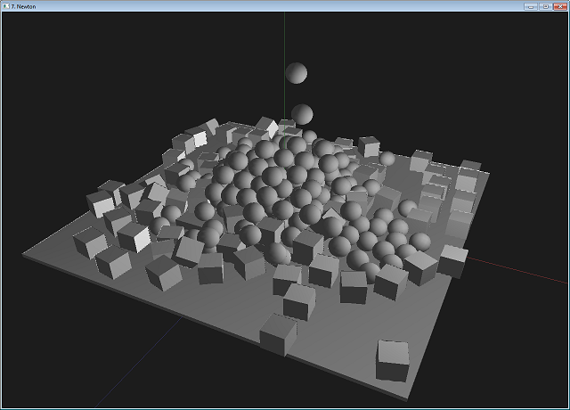

> Project news can be found in [russian translated](?ru) part of this site that frequently updates.
 

   Otus Lisp is a purely[*](#pure) functional dialect of Lisp.
It implements an extended subset of [R5RS](http://www.schemers.org/Documents/Standards/R5RS/) Scheme including, but not limited to some of the [SRFI](http://srfi.schemers.org/). It is small, embeddable and crossplatform.

   You can use it on Linux, Windows, *BSD, Android, webOS, Odroid. It runs on x86, arm, mips architectures with 32- and 64-bit platforms.

   You can immediately try Otus Lisp (ol) in the provided terminal on the left of this page. For example, type
<pre><code id="sample1" data-language="scheme">(+ 1 2 3 4 5 6 7)</code><button class="doit" onclick="doit(sample1.textContent)">send to the terminal</button></pre>
   After pressing "Enter" button you will receive *28*.

   Or you can try more interesting example
<pre><code id="sample2" data-language="scheme">(fold * 1 (iota 99 1 1))</code><button class="doit" onclick="doit(sample2.textContent)">send to the terminal</button></pre>
which is another way of
<pre><code id="sample3" data-language="scheme">(let factorial ((n 99))
   (if (= n 0)
      1
      (* n (factorial (- n 1)))))</code><button class="doit" onclick="doit(sample3.textContent)">send to the terminal</button></pre>

   This will produce factorial of 99 for you
<pre><code>> (let factorial ((n 99))
   (if (= n 0)
      1
      (* n (factorial (- n 1)))))
933262154439441526816992388562667004
907159682643816214685929638952175999
932299156089414639761565182862536979
208272237582511852109168640000000000
000000000000

> 
</code></pre>

### Download

   Available binary builds for:
   
  * CentOS, Fedora, OpenSUSE, RHEL, Debian, Ubuntu: from [openSUSE Build Service](https://software.opensuse.org/download.html?project=home%3Ayuriy-chumak&package=ol)

  
   I'm working for add more prebuilts.
   
### Project news

  * Thr 01 Dec 2016 18:06 EET
    * [build.opensuse.org](https://build.opensuse.org/package/show/home:yuriy-chumak/ol) works again, you can get prepared packages for the x86 CentOS 6, x86 Debian 7, x86 Debian 8, x86 Fedora 22, x86 Fedora 23, x86 RHEL 5, x86 RHEL 6, x86 ScientificLinux 6, x86 openSUSE 13.1, x86 openSUSE 13.2, armv7l openSUSE Factory, aarch64 openSUSE Factory, x86 Ubuntu 12.04, x86 Ubuntu 14.04, x86 Ubuntu 16.04
    
  * Wed 30 Nov 2016 21:53 EET
    * ol recompiled for odroid (please remember that ol works in "wild" under the odroid c1+ platform and provides web access to the server with remote terminal support)

  * Wed 30 Nov 2016 17:19 EET
    * added full android support to the ol, now full list of supported platforms is armeabi, armeabi-v7a, arm64-v8a, mips, mips64, x86, x86-64
    * successfully tested sockets under android armeabi, it works fine:
<pre><code>
C:\>adb shell
# cd /data/local/tmp
# ./ol
You see a prompt.
Type ',help' to help, ',quit' to end session
> (import (lib http))
> ;; Library (lib http) added
> ;; Imported (lib http)
> (http:run 8080 (lambda (fd request headers send close)
   (print ":: " (syscall 51 fd #f #f))
   (send "HTTP/1.0 200 OK\n"
         "Connection: close\n"
         "Content-Type: text/html; charset=UTF-8\n"
         "Server: " (car *version*) "/" (cdr *version*)
         "\n\n"
         "200: OK")
   (close #t)
))
Server binded to 8080
.
.
# Wed Nov 30 16:56:01 2016 : new request from (10.0.2.2 . 53275)
:: (10.0.2.2 . 53275)
socket closed, on-accept done.
# Wed Nov 30 16:56:02 2016 : request processed in 772ms.
.
# Wed Nov 30 16:56:02 2016 : new request from (10.0.2.2 . 53278)
.
# Wed Nov 30 16:56:02 2016 : new request from (10.0.2.2 . 53279)
:: (10.0.2.2 . 53278)
socket closed, on-accept done.
# Wed Nov 30 16:56:03 2016 : request processed in 748ms.
.
# Wed Nov 30 16:56:03 2016 : new request from (10.0.2.2 . 53280)
:: (10.0.2.2 . 53279)
socket closed, on-accept done.
# Wed Nov 30 16:56:04 2016 : request processed in 2238ms.
socket closed, on-accept done.
# Wed Nov 30 16:56:09 2016 : request processed in 5737ms.
</code></pre>

  * Mon 28 Nov 2016 17:32 EET
    * changed assembler code for the x86 and x86-64 pinvoke mechanism, decreased side and increased speed. for testing use neton-dynamics and opengl libraries
      
    * now "native" function can return float and double values, ol understands it and correctly receives
  * Thr 10 Nov 2016 19:23 EET
    * nothing happend, i'm continuing the project, simply no time to the commenting all steps
  * Previous news records can be found in [russian translated](?ru) part of this site
  
### Learn

   Current news can be found in [russian translated](?ru) part of this site that frequently updates.

   I'm writing docs right now. It will be available very soon. You can check <b><a href="?en/examples">SAMPLES</a></b> for now.
